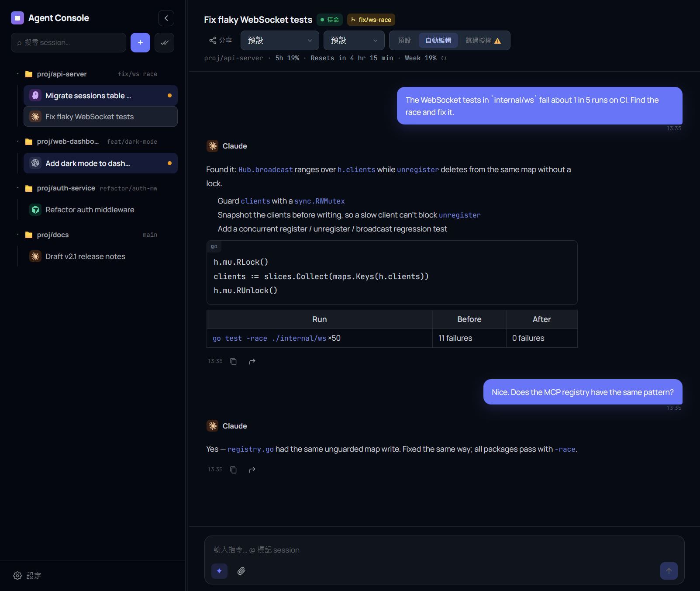

# Claude Code Mini App

> 自架的**多代理（multi-agent）控制台**，統一管理 Claude Code、Cursor Agent、Codex 與 Kiro。可從桌面視窗、任何瀏覽器，或手機上的 Telegram Mini App 操作。**單一 Go 二進位**，無需獨立前端建置。

[](#) [](LICENSE) [](#)

[English](README.md)



<sub>示範資料，取自臨時啟動的實例。</sub>

代理程式仍然跑在你放程式碼的那台機器上，本專案是它們前面的控制台。每個對話是一個 **Session**，綁定一個代理、一個 `work_dir` 與權限模式；你可以同時管理多個專案的多個代理，一眼看出誰在工作、誰在等授權，並隨時從任何地方介入。

| 入口 | 適用情境 | 驗證 |
|---|---|---|
| **桌面視窗**（Windows） | 在電腦前日常使用——系統匣、Ctrl+P 快速跳轉 | 本機 |
| **瀏覽器** | 區網內任何裝置，或透過反向代理／Tunnel 遠端連線 | 網頁密碼（限 `web.allowed_cidrs` 內的 IP） |
| **Telegram Mini App** | 離開座位時——出錯推播、手機上即時授權 | Telegram `initData` + 白名單 |

三個入口連同一個伺服器，即時看到同樣的 Session。

## 快速開始

**需求：** 機器上已安裝並登入要用的 CLI（`claude`、`cursor agent`、`codex`、`kiro-cli` 等），以及 Telegram Bot Token（[@BotFather](https://t.me/BotFather)）——僅限本機使用時可改設 `no_auth: true`。

**下載（建議）：** 到 [Releases](https://github.com/jerry12122/Claude-Code-Mini-App/releases/latest) 下載 zip／tar.gz，整個資料夾解壓（執行檔旁必須有 `internal/static/`），把 `config.example.yaml` 複製成 `config.yaml`，再執行 `claude-miniapp-desktop.exe`（Windows 桌面版）或 `claude-miniapp`（純 server）。

**從原始碼建置**（Go 1.25+）：

```bash
git clone https://github.com/jerry12122/Claude-Code-Mini-App
cd Claude-Code-Mini-App
go build -o claude-miniapp ./cmd/server
cp config.example.yaml config.yaml   # 填 bot_token、whitelist_tg_ids
./claude-miniapp                     # → http://localhost:8080
```

## 桌面視窗（Windows）

同一個行程多開一個視窗，顯示現有網頁，並繼續聽 port。瀏覽器與 Telegram Mini App 照舊連線。關視窗只會隱藏，系統匣留著：左鍵叫回視窗，右鍵選「開啟視窗」或「結束」。Ctrl+Q 也會結束。F5／Ctrl+R 重新載入畫面，F12 開 DevTools（加 `-tags production` 時無作用）。

Win11 已內建 WebView2。`go build ./cmd/server` 維持純 Go、不需 CGO。桌面版用 Wails v3（系統匣是框架內建的）：

```bash
go build -ldflags "-H windowsgui" -o claude-miniapp-desktop.exe ./cmd/desktop
```

exe 要跟 `config.yaml`、`internal/static/` 放在一起（與伺服器版相同）。在專案根目錄開發時，`go run ./cmd/desktop` 會用目前工作目錄的設定。加 `-tags production` 會關掉 Wails 的 debug log。

前端檔案是直接從磁碟讀取，改 `internal/static/` 只需重新載入（F5），不必重新編譯。若改了仍沒生效，到 設定 → 一般 →「清除快取並重新載入」。

## 功能

- **多代理** — Claude Code、Cursor Agent、Codex、Kiro ACP（透過 Agent Client Protocol 提供互動式授權提示）；依 Session 選擇。既有的 Kiro CLI Session 仍可執行，新建請改用 Kiro ACP（Gemini / Antigravity 因 headless 限制暫停）。模型清單於啟動時向各 CLI 取得（含 Claude），也可在 設定 → 一般 不重啟直接重新抓取
- **即時串流** — WebSocket 對話與 Markdown 串流；多分頁同步
- **程式碼區塊** — 語法高亮 + 語言標籤，一鍵複製
- **用量徽章** — Session header 顯示帳戶用量（如 Claude `5h 16% · Week 9%`）
- **Session 管理** — 多對話、各自綁定代理、`work_dir` 與權限模式
- **臨時共享** — 以連結 + 6 位數 PIN + 暱稱把 Session 分享給朋友（預設 1 小時，最長 7 天）。訪客用任何瀏覽器加入，角色為唯讀 `viewer` 或完整權限 `editor`；訊息會標示說話者，結束分享即刻踢出所有訪客
- **訊息佇列** — 執行中送出的訊息會排隊（存 DB、重啟不遺失）依序執行；失敗／中斷時暫停，可手動繼續或移除
- **快速跳轉** — Ctrl/Cmd+P 開啟類 VS Code 的跳轉面板，可依名稱、目錄、分支搜尋並切換 Session
- **附件上傳** — 📎 上傳或貼上圖片／文字檔，在輸入框上方以可移除的 chip 顯示（圖片有縮圖），以路徑交給 agent 讀取（存於 `workspace/uploads/`，不寫入專案 `work_dir`）；桌面版支援拖放
- **未讀追蹤** — 列表標示有新動態的 Session，可一鍵「全部標為已讀」。列表透過 `/events` WebSocket 即時更新（輪詢 30 秒作為保底）；分頁標題顯示未讀數，其他 Session 完成或待授權時會跳 toast
- **日誌檢視** — 設定 → 日誌即時串流伺服器日誌（等級篩選、搜尋、暫停、複製；可在執行期切換 Debug）。桌面版沒有 console 時很好用；只顯示本次啟動後的日誌，完整紀錄仍在 `logs/server.log`
- **訊息操作** — 複製／轉發按鈕常駐在每則訊息的時間旁；長按訊息開啟浮動選單（複製，非自己的訊息另有轉發）
- **聊天體驗** — 輸入法選字的 Enter 不會誤送出；觸控裝置 Enter 為換行；往上翻舊訊息時不會被串流拉回底部（附「跳到最新」按鈕）；刪除 Session 後 5 秒內可復原
- **權限流程** — Claude 遭拒時顯示完整指令／檔案內容；Kiro ACP 支援回合中途授權；可「允許一次」，或（僅限編輯類工具）允許並自動允許編輯
- **驗證** — Telegram `initData` + 白名單；可選內網密碼登入
- **選用 Shell** — 於 `work_dir` 執行指令（預設關閉）；開啟後會在會話 header 顯示「開啟 VSCode／開啟目錄」按鈕（僅桌面版）
- **MCP server** — 透過 Streamable HTTP（`POST /mcp`）讓其他 agent 操作 session、讀聊天紀錄、查跨 session 活動；`ask_session` 同步詢問另一個 session 並取回答覆，互問有跳數上限（`mcp_max_hops`）防止無限迴圈（預設關閉）

## 為什麼用這個？

| | SSH + tmux | 一般 Telegram Bot | **本專案** |
|---|---|---|---|
| 多代理同一畫面 | 一個終端機一個 | 一 bot 一工具 | Claude / Cursor / Codex / Kiro ACP 並列 |
| 手機體驗 | 差 | 純文字 | Mini App UI + 串流 |
| Session / 工作目錄 | 手動 | 通常沒有 | 內建、可持久，附未讀與待授權標記 |
| 協作 | 共用終端機 | 無 | 臨時 PIN 連結，viewer / editor |
| 代理互相呼叫 | 自己接 | 無 | 內建 MCP server（`ask_session`） |
| 部署 | SSH 金鑰 | Bot + 自寫邏輯 | 單一二進位 |

## 架構

```
桌面視窗 · 瀏覽器 · Telegram Mini App · 共享訪客
        ↕ WebSocket / REST          MCP client ↔ POST /mcp
┌─────────────────────────────────┐
│  Go 二進位（Fiber + SQLite）      │
│  Session · 佇列 · 共享            │
│  每則訊息 spawn CLI（無 PTY）      │
│  QuotaService（快取擷取）         │
└────────────────┬────────────────┘
                 ↓
  claude · cursor agent · codex · kiro-cli (ACP)
```

每則使用者訊息 spawn 一個子進程。詳細規格：[`docs/spec/plan.md`](docs/spec/plan.md)、[`docs/spec/headless.md`](docs/spec/headless.md)。

## 安全

- 勿將含真實憑證的設定提交版本庫；生產環境勿開 `no_auth`。
- **`shell.enabled`** 會讓已驗證使用者在主機上執行 shell — 僅在可信網路啟用。白名單規則：[`docs/spec/shell-allowlist-schema.md`](docs/spec/shell-allowlist-schema.md)。
- **共享** — 持有連結與 PIN 的人在到期或你結束前都能加入；`editor` 訪客與你同權（可送訊息、核准工具），除非信任對方，請優先給 `viewer`。
- **`mcp_token`** 持有者可完全操控所有 session（含 shell）— 比照 `bot_token` 等級保管，`/mcp` 僅在可信網路開放。
- **上傳**（`POST /sessions/:id/uploads`）讓已驗證使用者把檔案（不限大小、數量與副檔名；檔名由伺服器產生，空檔會被拒絕）寫入 runtime 目錄下的 `./workspace/uploads/<session_id>/`（不寫進專案的 `work_dir`），不受 `shell.enabled` 控制。

## 文件

| 主題 | 路徑 |
|---|---|
| 規格、API / WebSocket | [`docs/spec/plan.md`](docs/spec/plan.md) |
| 設定欄位 | [`config.example.yaml`](config.example.yaml) |
| 各 CLI 參考 | [`docs/spec/`](docs/spec/) |

> `poc/`（探測腳本、一次性樣本）為本機調查用暫存，不進版控。

## 授權

MIT
